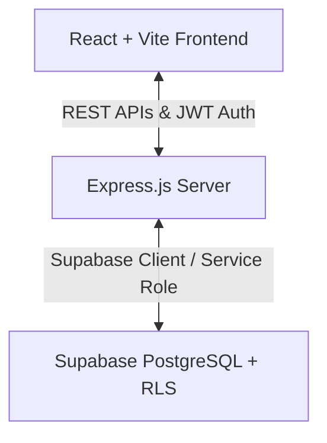

# Panacea HMS (Hospital Management System)

Panacea HMS is a modern, responsive Hospital Management System designed to handle clinical data, manage doctor schedules, log appointment bookings, manage visitor enquiries, and display dynamic hospital fees and health articles. 

This repository contains both the **React + Vite Frontend** and the **Express.js + Supabase Backend** as a unified workspace.

---

## 🏗️ Project Architecture



### Tech Stack
* **Frontend**: React, Vite, React Router, TailwindCSS, Axios
* **Backend**: Node.js, Express.js, Supabase JS SDK, JSON Web Tokens (`jsonwebtoken`), pure JS password hashing (`bcryptjs`), Security middleware (`cors`, `helmet`, `express-rate-limit`)
* **Database**: Supabase (PostgreSQL)

---

## 📁 Repository Structure
```text
├── backend/                   # Express.js REST API Server
│   ├── src/
│   │   ├── config/            # Supabase & app configurations
│   │   ├── controllers/       # Route request handlers
│   │   ├── db/                # PostgreSQL schema definitions
│   │   ├── middleware/        # JWT auth verification, validation filters
│   │   ├── routes/            # REST API route declarations
│   │   ├── seeds/             # Seed scripts & demo dataset
│   │   └── app.js             # Express application entrypoint
│   └── package.json           # Backend dependency configuration
│
├── frontend/                  # React + Vite Client Application
│   ├── src/
│   │   ├── components/        # Reusable visual components
│   │   ├── pages-admin.jsx    # Admin Dashboard panels & actions
│   │   ├── pages-public.jsx   # Public-facing views (Fees, Blog, Home, etc.)
│   │   └── main.jsx           # Global Axios setup & App mounting
│   └── package.json           # Frontend dependency configuration
│
└── README.md                  # Unified deployment & usage guide
```

---

## 🚀 Local Quickstart

### Prerequisites
* Node.js (v18 or higher recommended)
* NPM or Yarn

### Step 1: Database Setup (Supabase)
1. Create a new project on [Supabase](https://supabase.com/).
2. Navigate to the **SQL Editor** on your Supabase dashboard.
3. Paste and run the SQL query from [backend/src/db/schema.sql](file:///backend/src/db/schema.sql) to create the 8 necessary tables (`departments`, `doctors`, `appointments`, `enquiries`, `fees`, `articles`, `hospital_settings`, `admins`) and database functions.

### Step 2: Environment Variables
Create a file named `.env` inside the `backend/` directory:
```env
PORT=5000
SUPABASE_URL=https://your-project-ref.supabase.co
SUPABASE_ANON_KEY=your-anon-public-key
SUPABASE_SERVICE_ROLE_KEY=your-service-role-key
JWT_SECRET=your-custom-jwt-secret-key-here
JWT_EXPIRES_IN=24h
ALLOWED_ORIGINS=http://localhost:5173
```

### Step 3: Run Database Seeder
Before running the server, seed default datasets (departments, doctors, fees, blog posts, and the default admin user):
```bash
cd backend
npm install
npm run seed
```
* **Default Admin Account**: `admin@panaceameridian.com` / `admin123`

### Step 4: Launch Backend Server
```bash
npm run dev
```
The server will boot on `http://localhost:5000` in watch mode.

### Step 5: Launch Frontend Server
In a new terminal window:
```bash
cd frontend
npm install
npm run dev
```
Open `http://localhost:5173` in your browser.

---

## 🌐 Production Hosting Recommendations

### 1. Frontend Hosting (Vercel / Netlify / Cloudflare Pages)
* **Recommended Service**: **Vercel**
* **Why**: Perfect fit for Vite single-page applications (SPA). Offers global CDN, zero-config deployment, and seamless continuous deployment via GitHub.
* **Build Settings**:
  * **Framework Preset**: `Vite`
  * **Root Directory**: `frontend`
  * **Build Command**: `npm run build`
  * **Output Directory**: `dist`
  * **Rewrites (Routing)**: If page refreshes cause 404 errors, add a `vercel.json` file in the `frontend` folder:
    ```json
    {
      "rewrites": [{ "source": "/(.*)", "destination": "/index.html" }]
    }
    ```

### 2. Backend Hosting (Render / Railway / Vercel Serverless)
As the backend is lightweight, there are two primary options:

#### Option A: Vercel Serverless Functions (Unified Monorepo) — *Highly Recommended*
* **Why**: Since you are deploying the frontend on Vercel, you can host the Express backend as Vercel Serverless Functions in the same repository. This gives you:
  * Single project dashboard.
  * No cold-start sleep limits (unlike Render's free tier).
  * Direct domain routing.
* **Configuration**: Create a `vercel.json` at the **root** of the workspace:
  ```json
  {
    "version": 2,
    "builds": [
      {
        "src": "backend/src/app.js",
        "use": "@vercel/node"
      },
      {
        "src": "frontend/package.json",
        "use": "@vercel/static"
      }
    ],
    "routes": [
      {
        "src": "/api/(.*)",
        "dest": "backend/src/app.js"
      },
      {
        "src": "/(.*)",
        "dest": "frontend/$1"
      }
    ]
  }
  ```

#### Option B: Render or Railway — *Alternate Option*
* **Why**: Best if you prefer a persistent, traditional running Express server container.
* **Vercel Frontend + Render Backend**:
  * **Vercel**: Deploy the `frontend/` subdirectory.
  * **Render**: Deploy a Web Service pointing to the `backend/` directory. Set the Start Command to `npm start` and Build Command to `npm install`.
  * *Note on Render's Free Tier*: The server goes to sleep after 15 minutes of inactivity, causing a 50-second delay on the first API request. This can look laggy during a live demo. For zero delays, use **Railway** or Vercel Serverless instead.

### Production Environment Variables Checklist
Make sure to configure these environment variables in your hosting provider's dashboard:
1. `SUPABASE_URL` and keys (`SUPABASE_ANON_KEY`, `SUPABASE_SERVICE_ROLE_KEY`).
2. `JWT_SECRET`: Generate a cryptographically strong, random secret key.
3. `ALLOWED_ORIGINS`: Point this to your live production frontend URL (e.g., `https://panaceahms.vercel.app`) to block external CORS access.
